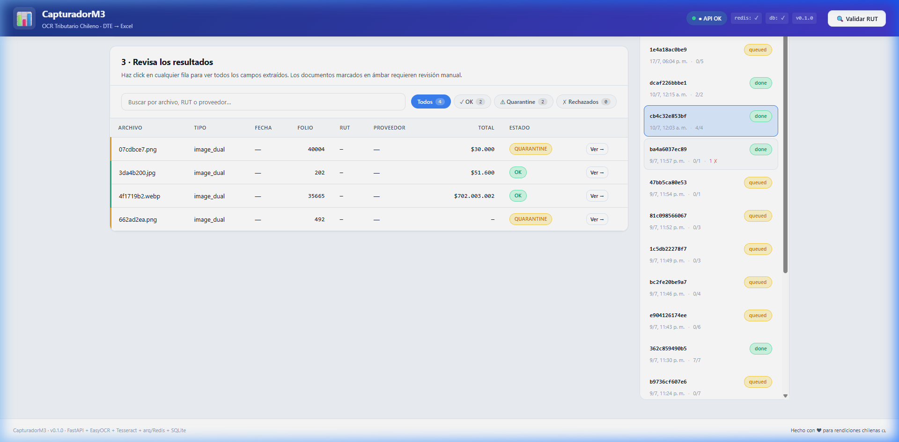
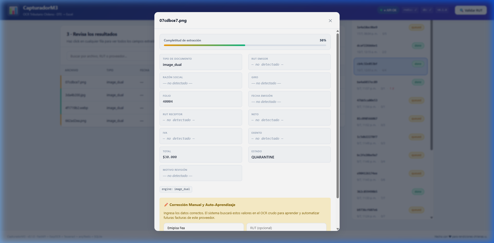

# Análisis de Ejecución y Diagnóstico de la Interfaz Actual — CapturadorM3

Este documento detalla el resultado de ejecutar la aplicación en tiempo real, interactuar con el flujo de carga/procesamiento e inspeccionar las pantallas con el fin de priorizar las decisiones de mejora.

---

## 🎥 Grabación de la Sesión de Evaluación
A continuación se muestra el video de la simulación del navegador interactuando con la interfaz actual:

---

## 🚨 Bug Crítico Identificado (Bloqueante Principal)

### Paso 4 ("Entregar") y Botón de Exportar son inaccesibles en la UI
* **El Problema**: El botón para exportar a Excel (`#btn-download-excel`) reside en el contenedor del Paso 4 (`#step-4`), el cual tiene la propiedad de estilo CSS `display: none` por defecto.
* **Causa**: 
  - La función `goToStep(4)` **nunca se invoca** en la lógica de `static/app.js` después de procesar.
  - El menú de navegación de pasos bloquea la navegación manual al paso 4 debido a que `activeStep` nunca se incrementa a 4, y el paso 4 nunca es marcado como `done`.
* **Impacto**: El usuario común **no puede descargar el archivo Excel** generado desde la interfaz web, lo que inutiliza la SPA para descarga directa.

---

## 📸 Capturas de Pantalla Obtenidas

### 1. Tabla de Resultados (Paso 3)
La tabla muestra el estado cargado de 4 documentos procesados: dos marcados en verde (`OK`) y dos en amarillo (`QUARANTINE`).

### 2. Modal de Detalle (Actual)
Al hacer click en "Ver" en un registro con estado `QUARANTINE`, se despliega este modal. Su diseño actual requiere scroll para rellenar campos y no muestra de manera clara y lado-a-lado el documento original para contrastar la lectura con el OCR.

---

## 🎯 Priorización de Decisiones (Qué realizar primero)

Basándonos en esta ejecución real, proponemos priorizar los cambios en este orden estricto:

### 1️⃣ Corrección Inmediata del Flujo de Pasos e Integración del Botón de Exportar (Prioridad 1)
* **Acción**: Eliminar el Paso 4 ("Entregar") como una tarjeta separada u oculta. 
* **Propuesta**: Integrar el botón **`📥 Exportar Planilla Excel`** de manera permanente y muy visible arriba o al costado de la Tabla de Resultados en el Paso 3. Una vez procesado el lote, el botón se ilumina automáticamente.

### 2️⃣ Rediseño del Modal de Detalle / Revisión Manual (Prioridad 2)
* **Acción**: Reemplazar el modal plano actual por un layout de dos columnas lado-a-lado:
  * **Columna Izquierda**: El visor del PDF o la Imagen de la boleta/factura.
  * **Columna Derecha**: El formulario editable con los datos reconocidos (RUT, Fecha, Total) y botones de confirmación rápidos. Esto permite que el usuario corrija los datos de un vistazo rápido sin cerrar pantallas ni usar scrolls incómodos.

### 3️⃣ Automatización de la Transición Cargar ➔ Procesar (Prioridad 3)
* **Acción**: Al arrastrar y soltar (o seleccionar) los 4 archivos en el Paso 1, hacer que el backend se active automáticamente y muestre directamente el progreso en la misma pantalla en lugar de requerir que el usuario presione el botón manual "⚡ Procesar ahora".
