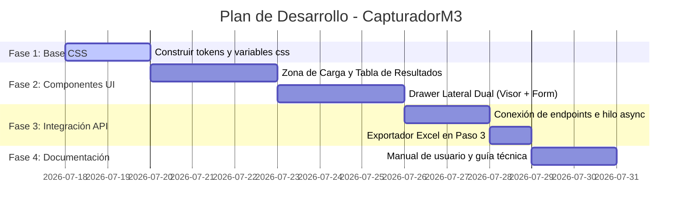

# Pipeline y Plan de Desarrollo Frontend & Documentación — CapturadorM3

Este documento define las fases, metodologías e integración de habilidades de diseño para el desarrollo de la interfaz de usuario y la documentación del proyecto **CapturadorM3**.

---

## 🎨 Habilidades y Principios de Diseño Integrados
Adherido a las mejores prácticas de desarrollo de aplicaciones web premium, el desarrollo del frontend se regirá por:
- **Estética de Alto Impacto (Rich Aesthetics)**: Paleta de colores oscuros curada (fondos `#0B0F19`, acentos de color verde esmeralda `#10B981` y azul eléctrico `#3B82F6`), sombras difusas y bordes semi-transparentes de 1px (Glassmorphism).
- **Tipografía y Micro-interacciones**: Fuente **Inter** o **Outfit** cargada vía CDN para dar un aire premium. Transiciones suaves de 0.2s en botones, hovers y estados activos.
- **Accesibilidad y SEO**: HTML5 semántico (`<header>`, `<main>`, `<section>`), atributos `aria-label` para botones de acción rápida e identificadores únicos (`id`) en elementos interactivos para garantizar pruebas automatizadas estables.

---

## 📅 Fases del Pipeline de Desarrollo

### 📋 Fase 1: Arquitectura de Diseño Base (CSS Tokens)
* **Objetivo**: Crear la hoja de estilos base (`index.css` / `app.css`) con variables personalizadas para colores, espaciados y efectos visuales de cristal.
* **Entregables**:
  - Declaración de variables CSS (`--primary`, `--bg-dark`, `--glass-bg`, `--font-family`).
  - Clases utilitarias globales de Glassmorphism.
  - Estructura base responsive optimizada para pantallas desde 1280px hasta 1920px.

### 🧩 Fase 2: Componentes de Interfaz e Interacciones
* **Objetivo**: Desarrollar los bloques visuales clave en vanilla JavaScript y HTML semántico sin placeholders.
* **Pasos**:
  1. **Dashboard Unificado**: Diseñar la cabecera fija, las tarjetas resumen de estado y el área de Drag & Drop automatizada.
  2. **Tabla de Resultados con Acciones**: Reemplazar la tabla básica por una grilla moderna con badges de color para estados (`OK`, `QUARANTINE`, `REJECTED`) y botones individuales de exportación y edición.
  3. **Drawer Deslizable Dual**: Implementar la vista del PDF/Imagen lado a lado con el formulario inteligente de validación en tiempo real.

### 🔌 Fase 3: Integración de API y Automatización
* **Objetivo**: Conectar los triggers de la interfaz con los endpoints del backend (`/api/v1/ocr/upload` y `/api/v1/jobs/`).
* **Pasos**:
  1. **Auto-Trigger de Carga**: Modificar la lógica para que al soltar archivos se llame directamente a la API sincrónica o asíncrona (si está marcado el modo batch) mostrando progreso inmediato.
  2. **Persistencia y Botón de Exportación**: Habilitar el botón principal **`📥 Exportar Excel`** directamente en la tabla tras recibir la respuesta de la API, apuntando a `/api/v1/jobs/{job_id}/export`.

### ✍️ Fase 4: Documentación de Producción y Guías
* **Objetivo**: Asegurar la mantenibilidad del proyecto documentando el nuevo estándar visual y el funcionamiento de la API.
* **Entregables**:
  - **Manual de Usuario Actualizado**: Explicando el nuevo flujo automatizado de pantalla única.
  - **Guía de Estilos Frontend**: Documentando los tokens de CSS y cómo agregar nuevos temas visuales.
  - **Especificación de Endpoints**: Swagger interactivo integrado.
