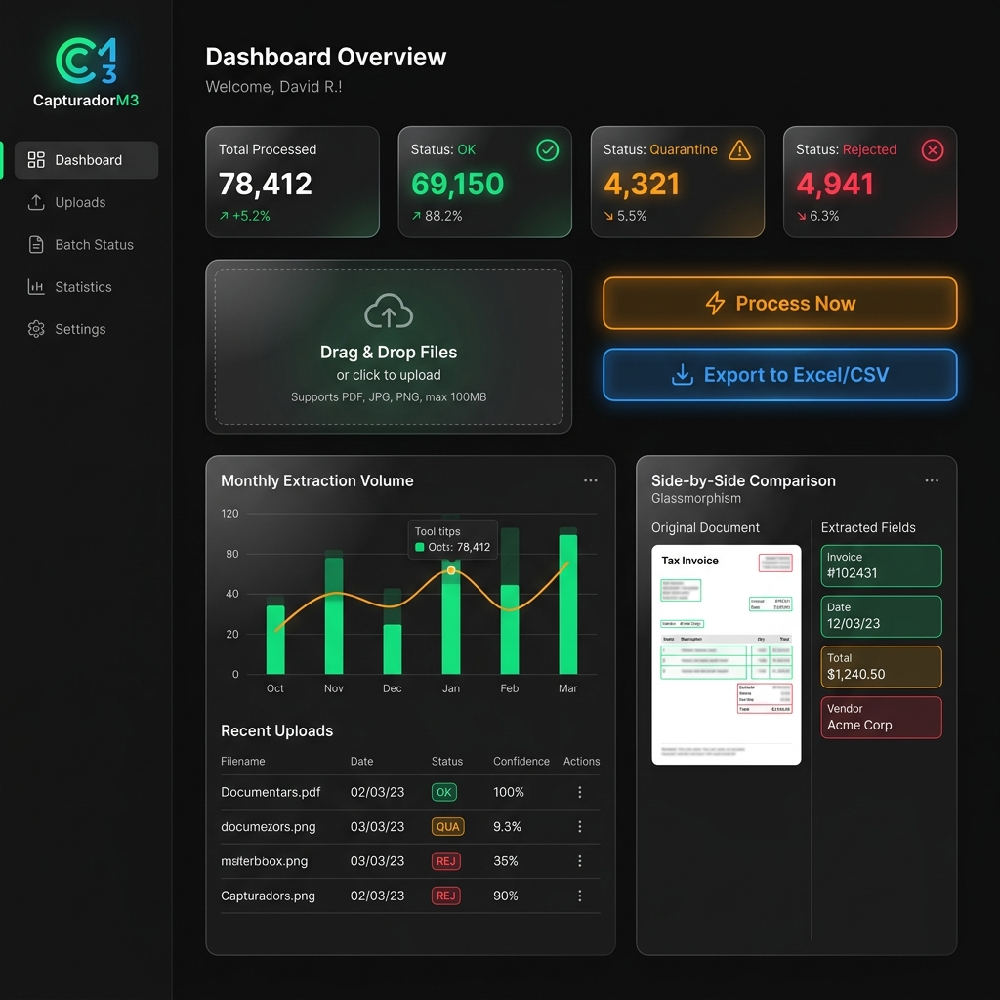
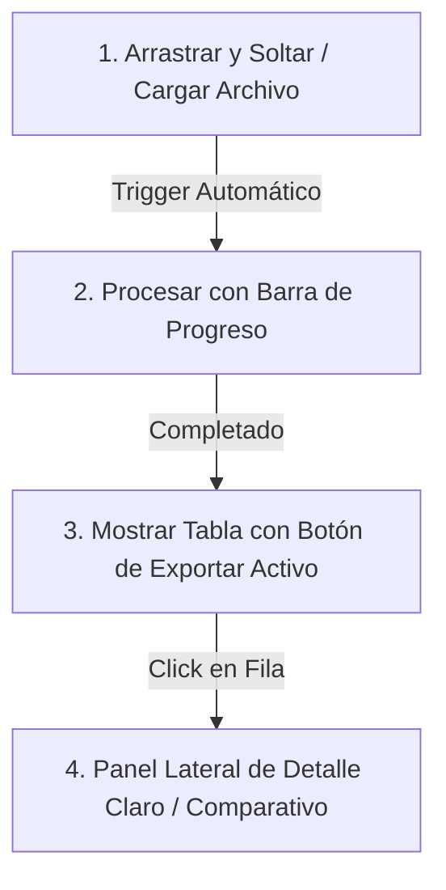

# Propuesta de Rediseño de Interfaz de Usuario (UI/UX) — CapturadorM3

Esta propuesta detalla la modernización visual y funcional de la interfaz de **CapturadorM3**, haciéndola intuitiva, automatizada y "comprensible a primera vista" sin requerir manuales de entrenamiento.

---

## 🎨 1. Concepto Visual y Estética Premium
Proponemos un diseño de **estilo Dark Mode con Glassmorphism** (efecto de vidrio esmerilado con bordes brillantes y sutiles gradientes de color), utilizando la tipografía moderna **Outfit** o **Inter**. Este enfoque transmite inmediatamente que es una herramienta tecnológica de nivel empresarial.

### 🖼️ Boceto Digital / Mockup del Dashboard Propuesto

---

## ⚡ 2. Automatización del Flujo de Trabajo
En lugar de forzar al usuario a pasar manualmente por 4 pantallas, la UI operará en **una sola pantalla dinámica (Dashboard)** basada en tres pilares:

1. **Subida y Procesamiento Auto-Trigger**: Al soltar los archivos en la zona de drop, el sistema iniciará inmediatamente el procesamiento en background sin necesidad de presionar "Procesar". Una barra de carga lineal y limpia (con degradado de color) reemplazará el texto plano.
2. **Estados Instantáneos**: Tarjetas de resumen en la parte superior con números gigantes que indican cuántos documentos están listos y cuántos necesitan atención:
   - 🟢 **Procesados Correctamente (OK)**
   - 🟡 **En Revisión Manual (Quarantine)**
   - 🔴 **Descartados (Rejected)**

---

## 📥 3. Botones de Exportar Siempre Visibles
El usuario no debe buscar dónde descargar sus resultados. Proponemos un **Header de Acciones Flotante** y botones en la tabla:

- **Botón Principal de Exportación**: Un botón destacado con estilo "Glassmorphic" y degradado verde-azul: **`📥 Exportar Planilla de Rendición`**, ubicado de forma fija en la esquina superior derecha de la tabla de resultados. Estará deshabilitado si no hay datos en memoria, y se iluminará con una animación cuando haya resultados listos.
- **Acciones Rápidas por Fila**: Para los documentos individuales ya listados y en memoria, cada fila de la tabla tendrá una columna final de **Acciones Rápidas** con:
   - Un botón de **Descarga rápida (Excel/PDF individual)**.
   - Un botón de **Validar RUT** que abre el validador precargando el RUT de esa fila.

---

## 🔍 4. Pantalla de Detalles Entendible (Side-Panel Dual)
La actual pantalla de detalles puede ser confusa si mezcla metadatos crudos con campos editables. Proponemos un **Panel Lateral Deslizable (Drawer)** que aparece al hacer click en cualquier fila:

### Layout del Panel de Detalle (Dividido en 2 columnas)
* **Lado Izquierdo (Visualizador)**: 
  Una vista previa del documento original (PDF/Imagen) con un resaltador amarillo sobre las zonas donde se leyó la información (RUT, Fecha, Total).
* **Lado Derecho (Datos Extraídos)**:
  Un formulario limpio con tarjetas de colores según el estado de confianza del campo:
  - **Fecha**: `2026-07-17` 🟢 *Leído correctamente (Confianza 98%)*
  - **RUT Emisor**: `76.123.456-7` 🟡 *RUT sin Dígito Verificador (Corregido automáticamente)*
  - **Total**: `18.521` 🟢 *Confirmado*
  
  > [!TIP]
  > Si un campo está en cuarentena (ej. falta el RUT), el campo de texto se mostrará en color ámbar con un mensaje claro: *"No pudimos leer el RUT con claridad. Por favor, corrígelo aquí."* y un botón de **Guardar Cambios** destacado al pie del panel.
