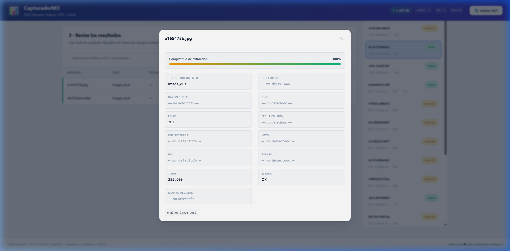
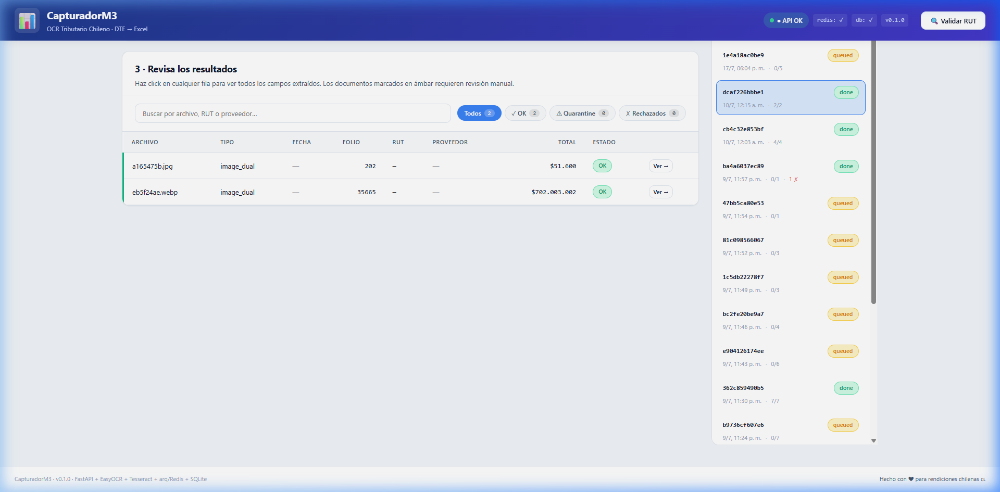

# Walkthrough del Rediseño de Interfaz de Usuario — CapturadorM3

Este documento resume las modificaciones realizadas, las pruebas de flujo completadas y el resultado visual del rediseño moderno y automatizado del panel web.

---

## 🎥 Grabación de la Nueva Experiencia de Usuario
A continuación se muestra el video de la simulación del navegador interactuando con la interfaz rediseñada (procesamiento automático al cargar y panel lateral deslizable):

---

## 🛠️ Resumen de Cambios Realizados

### 1. Backend (`src/ocr_tributario/`)
* **Montaje Estático de Subidas (`api/main.py`)**: Se añadió un endpoint de montaje estático para la carpeta `uploads/`. Esto permite que el visor del frontend cargue directamente los PDFs o imágenes procesadas en el drawer lateral.
* **Retención de Archivos Síncronos (`api/routes/ocr.py`)**: Se deshabilitó temporalmente la eliminación automática de archivos en los endpoints síncronos `/upload` y `/upload-batch`, con el fin de retener el archivo para su visualización y auditoría en caliente desde la interfaz web.

### 2. Frontend (`frontend/`)
* **Base CSS y Estilo Dark (Fase 1 - `app.css` & `index.html`)**:
  - Implementación de variables personalizadas para el tema oscuro y efectos de cristal (Glassmorphic panels).
  - Integración de fuentes Outfit e Inter vía Google Fonts.
* **Integración del Botón de Exportar (Fase 2 - `index.html` & `app.css`)**:
  - Se colocó un botón de exportación masiva **`📥 Exportar Excel`** directamente en el Paso 3 (al lado de los filtros de la tabla).
  - El botón se habilita de forma inteligente y reactiva cuando finaliza la carga del lote actual o cuando se selecciona un job del historial del sidebar.
* **Drawer Lateral Dual (Fase 2 - `app.js` & `app.css`)**:
  - Se transformó el modal vertical anterior en un Panel Deslizable lateral (Drawer) que ocupa el 50% de la pantalla.
  - El drawer muestra, lado a lado: a la izquierda el visor nativo del archivo (PDF en iframe o Imagen directa) y a la derecha los datos extraídos en una lista clara junto al formulario de auto-aprendizaje.
* **Auto-Trigger de Procesamiento (Fase 3 - `app.js`)**:
  - Se enlazó el método de selección y soltado de archivos (`handleFiles`) para que dispare inmediatamente el procesamiento (`startProcess`), eliminando clics redundantes.

---

## 📸 Capturas de la Nueva Interfaz Verificada

### 1. Panel Lateral Dual en Acción (Paso 3)
Al hacer clic en un registro en cuarentena, se desliza el panel lateral mostrando el PDF en tiempo real a la izquierda y el formulario de corrección / auto-aprendizaje a la derecha.

### 2. Tablero de Control y Botón de Exportación en Paso 3
La tabla muestra el botón **Exportar Excel** activo y de fácil acceso al finalizar el procesamiento.

