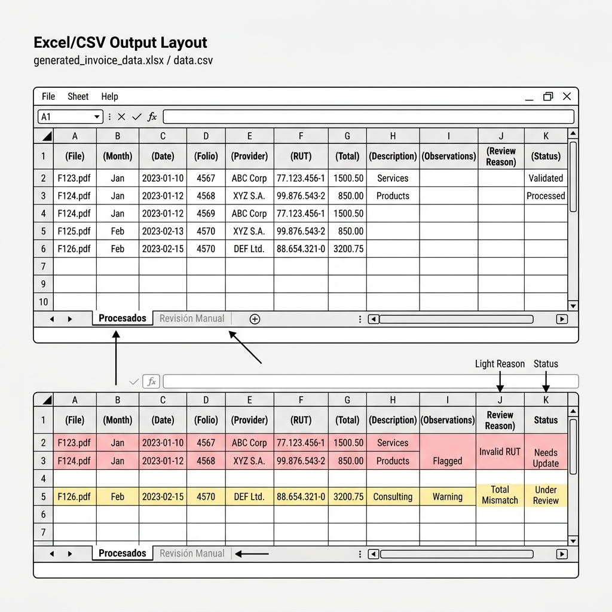

# Wireframe y Estructura de Salida (Excel & CSV) — CapturadorM3

Este documento detalla la distribución de columnas, formatos de datos y el diseño visual de los archivos de salida generados por el sistema para su entrega a contabilidad.

---

## 📐 Estructura del Archivo de Salida
El siguiente esquema ilustra el diseño del libro Excel con sus pestañas y la codificación del archivo CSV:

---

## 📊 1. Diseño del Archivo Excel (`.xlsx`)
El Excel generado se compone de **dos pestañas** diferenciadas por colores y estados de los datos:

### Pestaña 1: "Procesados" (Pestaña Verde 🟢)
Contiene solo los documentos que pasaron todas las validaciones (Fecha, RUT y Total correctos).

* **Formato Visual**: Cabecera fija (con freeze pane) en azul oscuro con texto blanco, auto-ajuste de columnas y bordes delgados.
* **Estructura de Columnas**:

| # | Columna | Tipo de Dato | Formato Excel | Ejemplo de Valor |
|---|---|---|---|---|
| **A** | Archivo | Texto | General | `boleta-1.png` |
| **B** | Mes | Texto | General | `2026-07` |
| **C** | Fecha | Fecha | `yyyy-mm-dd` | `2026-07-17` |
| **D** | Nro Boleta Factura | Entero | `#` | `53880422` |
| **E** | PROVEEDOR | Texto | General | `Telefónica Chile S.A.` |
| **F** | RUT | Texto | General | `90.635.000-9` |
| **G** | Total | Numérico | `$#,##0` o `#,##0` | `18521` (numérico sumable) |
| **H** | Descripción del gasto | Texto | General | *(Vacío para llenado manual)* |
| **I** | Observaciones | Texto | General | *(Vacío para llenado manual)* |

---

### Pestaña 2: "Revisión Manual" (Pestaña Amarilla/Roja 🟡)
Contiene los registros clasificados como `QUARANTINE` o `REJECTED`. 

* **Formato Visual**: Filas con fondo suave rojo claro (`#FFEBEE`) o amarillo claro (`#FFF9C4`) para llamar la atención del analista.
* **Estructura de Columnas**:
  - Cuenta con las **mismas 9 columnas** de la pestaña "Procesados" para facilitar copiar y pegar una vez corregidos los datos, pero se le anteponen 2 columnas de auditoría:
    1. **Estado**: `QUARANTINE` o `REJECTED`
    2. **Motivo de Revisión**: Mensaje descriptivo (ej. `Falta: rut_emisor | Completitud: 67%` o `Excepción: PDF corrupto`).

---

## 📄 2. Diseño del Archivo CSV (`.csv`)
Para integraciones rápidas con sistemas ERP o de contabilidad, se generan dos archivos CSV con las siguientes reglas de exportación chilenas:

1. **Delimitador**: Punto y coma (`;`). Esto evita que los decimales o las comas en los nombres de proveedores rompan las columnas en configuraciones de Excel en español.
2. **Codificación**: **UTF-8 con BOM** (`utf-8-sig`). Esencial para que al hacer doble click en Windows/Excel, los acentos, caracteres `N°`, y la letra `Ñ` de "Cédula de Identidad" o "Rendición" se visualicen correctamente sin configuraciones previas.

### Archivos Generados:
* `Rendicion_Gastos_OCR.csv`: Contiene solo los registros listos (`OK`).
* `Rendicion_Gastos_OCR_revision.csv`: Incluye todos los registros con sus respectivas columnas de `estado` y `motivo_revision`.
