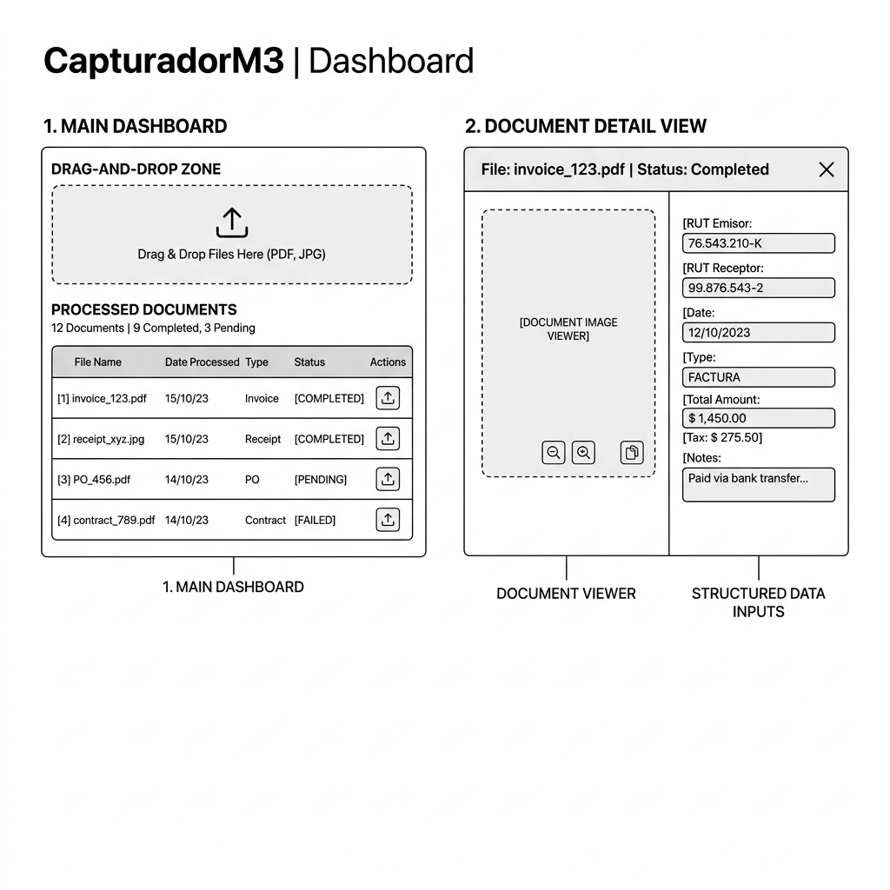

# Wireframe de la Nueva Experiencia de Usuario (UX) — CapturadorM3

Este documento detalla la arquitectura de información, distribución de componentes e interacciones de la propuesta de mejora en un solo plano interactivo.

---

## 📐 Estructura Esquemática del Wireframe
El siguiente esquema muestra cómo se distribuyen las secciones para evitar la navegación por pasos secuenciales y permitir el control inmediato en una sola vista:



---

## 🏗️ Desglose de Componentes en Pantalla Única

### 1. Zona Superior: Carga y Mando Directo (1/3 de la Pantalla)
* **Zona de Soltar Archivos (Drag & Drop Zone)**: Ocupa el centro superior. 
  - Al soltar archivos, la caja activa un spinner sutil indicando: *"Cargando y procesando {n} archivos..."* sin necesidad de hacer clic en otro botón.
* **Filtros e Indicadores Rápidos (KPI Cards)**:
  - Tres tarjetas interactivas que funcionan como filtros rápidos al hacerles clic:
    * `🟢 {n} OK`
    * `🟡 {n} En Cuarentena`
    * `🔴 {n} Rechazados`
* **Botones Globales Flotantes**:
  - Un botón de gran formato: **`📥 Exportar Excel de Rendición`** (color de marca, permanentemente visible).
  - Un botón secundario: **`🔍 Validar RUT (SII)`**.

### 2. Zona Central: Grilla de Resultados Dinámica (2/3 de la Pantalla)
Una tabla expandible que muestra los documentos procesados en memoria:

| Archivo | Estado | RUT Emisor | Proveedor | Total | Acciones |
|---|---|---|---|---|---|
| `boleta_1.png` | `🟢 OK` | `76.123.456-7` | *Claro Chile* | `$18.520` | `[Ver Detalle]` `[Exportar]` |
| `fac_332.pdf` | `🟡 CUARENTENA` | `(Incompleto)` | *Desconocido* | `--` | `[Corregir]` `[Eliminar]` |

* **Fila Interactiva**: Al pasar el puntero por una fila, se resalta y muestra el botón `[Ver Detalle / Corregir]`.

---

## 🗂️ 3. Drawer Lateral (Detalle & Verificación Dual)
Cuando el usuario hace clic en `[Ver Detalle]` o `[Corregir]`, se desliza un panel desde la derecha ocupando el 50% de la pantalla para evitar que el usuario pierda el contexto de la tabla:

```
┌─────────────────────────────────────────────────────────────┐
│                       DETALLE DEL DOCUMENTO                 │
├──────────────────────────────┬──────────────────────────────┤
│ LADO IZQUIERDO: VISOR        │ LADO DERECHO: EDICIÓN        │
│                              │                              │
│ ┌──────────────────────────┐ │  Proveedor:                  │
│ │                          │ │  [ Claro Chile S.A.        ] │
│ │       BOLETA             │ │                              │
│ │   Rut: 76.123.456-7      │ │  RUT Emisor:                 │
│ │   Total: $18.520         │ │  [ 76.123.456-7            ] 🟢│
│ │                          │ │                              │
│ │                          │ │  Total ($):                  │
│ │                          │ │  [ 18520                   ] 🟢│
│ └──────────────────────────┘ │                              │
│                              │  [ Guardar Cambios ] [Cerrar]│
└──────────────────────────────┴──────────────────────────────┘
```

### Características del Drawer:
- **Resaltado Inteligente**: Al hacer foco en el campo "Total" de la derecha, el visor de la izquierda hace zoom automático en la parte inferior de la boleta donde se ubica el total.
- **Validación en Tiempo Real**: Si el RUT ingresado es inválido por Módulo 11, el campo se tiñe de rojo inmediatamente alertando al usuario antes de guardar.
